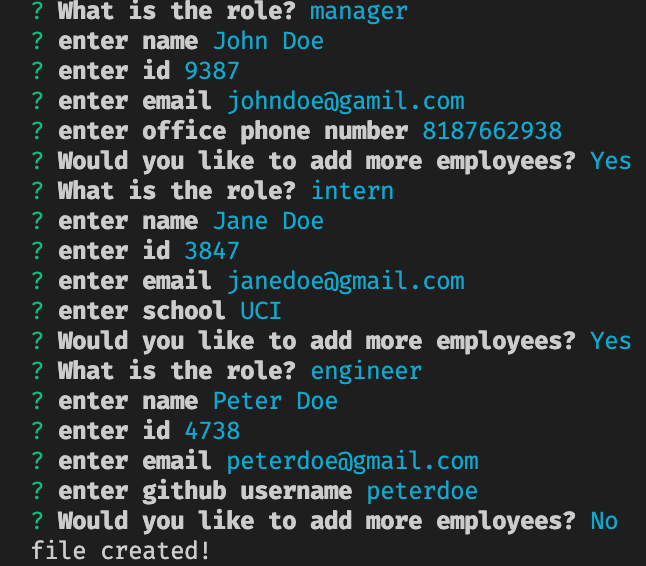
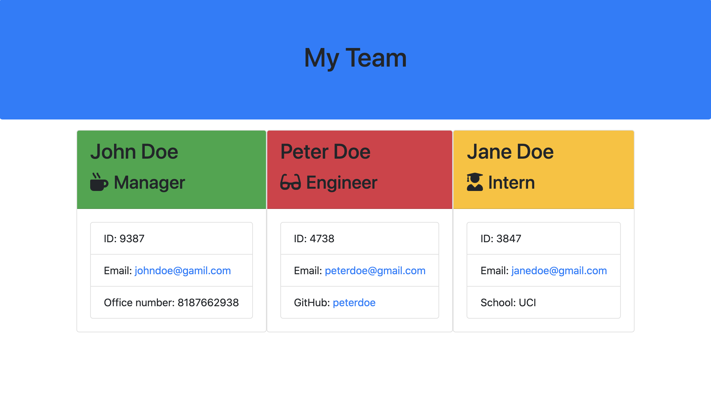

# Template Engine
## Description

This is a software engineering team generator command line application. The application will prompt the user for information about the team manager and then information about the team members. The user can input any number of team members, and they may be a mix of engineers and interns. When the user has completed building the team, the application will create an HTML file that displays a nicely formatted team roster based on the information provided by the user. The app will run as a Node CLI to gather information about each employee.

## Installation

This app requires installing [inquirer](https://www.npmjs.com/package/inquirer) for collecting input from the user.

## Usage

The project prompts the user to build an engineering team. An engineering
team consists of a manager, and any number of engineers and interns.

## Screenshots

## Styling Libraries

This app was created using the [Bootstrap styling library](https://getbootstrap.com/)
